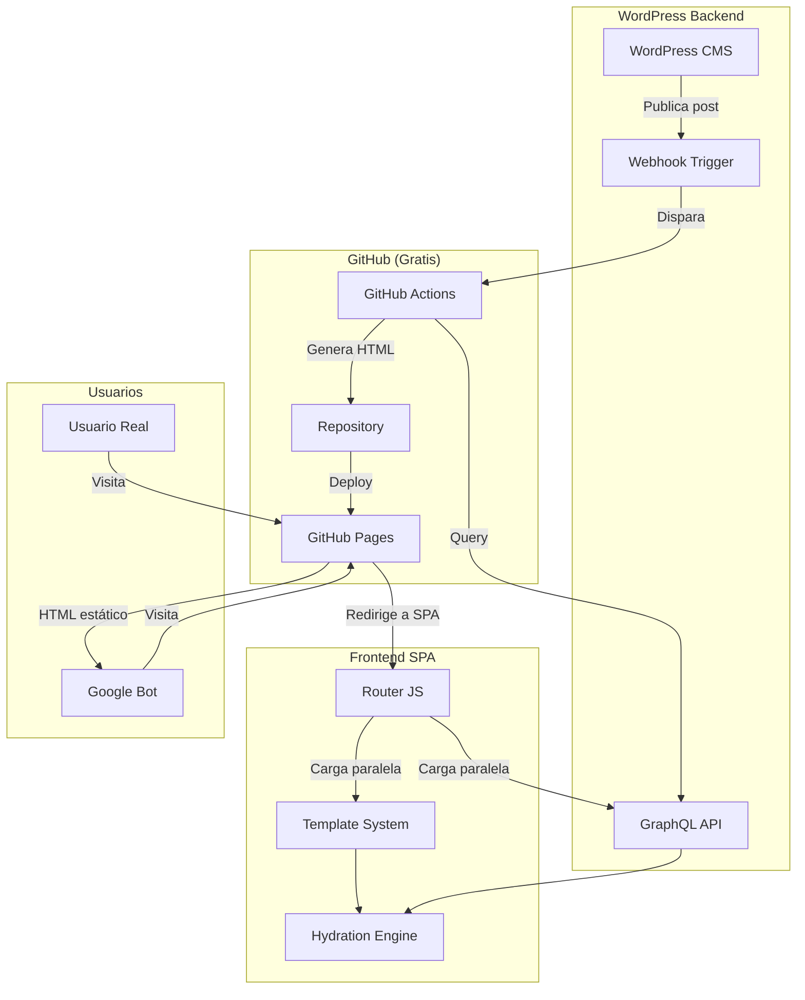

# Proyecto SEO Klef Agency: Arquitectura Completa

> **Documento maestro:** Explicación técnica del sistema de generación de páginas SEO con templates dinámicos y carga paralela.

---

## 📋 Índice

1. [Visión General del Proyecto](#-visión-general-del-proyecto)
2. [Problema que Resuelve](#-problema-que-resuelve)
3. [Arquitectura del Sistema](#-arquitectura-del-sistema)
4. [Componentes Principales](#-componentes-principales)
5. [Flujo de Datos Completo](#-flujo-de-datos-completo)
6. [Implementación Técnica](#-implementación-técnica)
7. [Plan de Ejecución](#-plan-de-ejecución)
8. [Estrategia de Triggers](#-estrategia-de-triggers)
9. [Ventajas del Sistema](#-ventajas-del-sistema)
10. [Próximos Pasos](#-próximos-pasos)

---

## 🎯 Visión General del Proyecto

Klef Agency necesita un sistema que:

1. **Genere páginas HTML estáticas** con URLs amigables para SEO
2. **Mantenga la experiencia de SPA** fluida para usuarios reales
3. **Se actualice automáticamente** cuando se publiquen posts en WordPress
4. **Sea 100% gratis** y no requiera servidor adicional
5. **Cargue en paralelo** templates y datos para máxima velocidad

---

## 🔍 Problema que Resuelve

### Estado Actual

```
Usuario o Bot visita:
https://klef.agency/portfolio/proyecto-x
    ↓
GitHub Pages sirve: index.html (SPA)
    ↓
JavaScript carga y consulta GraphQL
    ↓
Renderiza contenido dinámicamente
    ↓
❌ Google ve HTML vacío inicialmente
❌ Meta tags se actualizan tarde
❌ Indexación lenta (2-4 semanas)
```

### Estado Deseado

```
Google Bot visita:
https://klef.agency/portfolio/proyecto-x
    ↓
GitHub Pages sirve: /portfolio/proyecto-x/index.html
    ↓
✅ HTML estático con contenido completo
✅ Meta tags pre-renderizados
✅ Indexación rápida (2-4 días)

Usuario Real visita:
https://klef.agency/portfolio/proyecto-x
    ↓
Detecta que no es bot
    ↓
Redirige a SPA dinámica
    ↓
✅ Experiencia fluida sin recargas
✅ Templates dinámicos
✅ Navegación instantánea
```

---

## 🏗️ Arquitectura del Sistema

### Diagrama de Alto Nivel



---

## 🧩 Componentes Principales

### 1. **Template Skeleton (HTML puro)**

**Ubicación:** `/templates/portfolio-skeleton.html`

**Función:**
- HTML estático con estructura completa
- IDs únicos para cada elemento a hidratar
- Shimmer skeleton mientras carga
- CSS embebido para carga instantánea

**Características:**
```html
<!-- IDs estratégicos para hidratación -->
<h1 id="project-title">Cargando...</h1>
<div id="hero-visual"></div>
<div id="main-content"></div>
<div id="team-avatars-container"></div>
<div id="project-tags"></div>
```

**Estado inicial:**
```html
<body data-loading="true">
  <!-- Shimmer automático en todos los elementos -->
</body>
```

---

### 2. **Sistema de Hidratación (JavaScript)**

**Ubicación:** `/src/utils/hydration.js`

**Función:**
- Esperar a que elementos existan en el DOM
- Llenar elementos con datos de GraphQL
- Manejar diferentes tipos de templates
- Actualizar meta tags dinámicamente

**Módulos:**

```javascript
// dom-helpers.js
waitForElement(selector)      // Espera elemento específico
waitForElements(selectors)    // Espera múltiples elementos
waitForId(id)                 // Espera elemento por ID
waitForIds(ids)               // Espera múltiples IDs

// hydration.js
class PortfolioHydrator {
  constructor(data, template)
  async hydrate()              // Método principal
  hydrateHeroGallery()         // Template específico
  hydrateCaseStudy()           // Template específico
  hydrateBeforeAfter()         // Template específico
  hydrateVideoShowcase()       // Template específico
}
```

---

### 3. **Router con Carga Paralela**

**Ubicación:** `/src/router.js`

**Función:**
- Detectar ruta del usuario
- Cargar template y datos EN PARALELO
- Inyectar template en DOM
- Hidratar con datos
- Actualizar meta tags

**Flujo de carga:**

```javascript
async handlePortfolioDetail(slug) {
  // 🚀 CARGA PARALELA
  const [graphqlData, templateModule] = await Promise.all([
    fetchPostBySlug(slug),                      // 250ms
    import('./templates/portfolio-templates.js') // 10ms
  ]);
  
  // ⚡ INYECTAR TEMPLATE
  app.innerHTML = template;
  
  // 💧 HIDRATAR
  const hydrator = new PortfolioHydrator(graphqlData, templateId);
  await hydrator.hydrate();
  
  // 🎨 META TAGS
  this.updatePageMeta(graphqlData);
}
```

**Timeline:**
```
t=0ms    → Inicia carga
t=250ms  → Ambos completados (paralelo)
t=260ms  → Template inyectado
t=265ms  → IDs esperados
t=270ms  → Hidratado completo
✅ Total: ~270ms (vs. 500ms secuencial)
```

---

### 4. **Generador de Páginas SEO (Node.js)**

**Ubicación:** `/scripts/generate-seo-pages.js`

**Función:**
- Consultar todos los posts de WordPress vía GraphQL
- Generar HTML mínimo con meta tags completos
- Crear estructura `/portfolio/{slug}/index.html`
- Generar `sitemap.xml`
- Commit automático a GitHub

**Características del HTML generado:**

```html
<!DOCTYPE html>
<html lang="es">
<head>
    <!-- SEO completo -->
    <title>Proyecto X | Klef Agency</title>
    <meta name="description" content="...">
    <link rel="canonical" href="...">
    
    <!-- Open Graph -->
    <meta property="og:title" content="...">
    <meta property="og:image" content="...">
    
    <!-- Twitter Cards -->
    <meta name="twitter:card" content="...">
    
    <!-- Schema.org -->
    <script type="application/ld+json">
    {
        "@context": "https://schema.org",
        "@type": "Article",
        ...
    }
    </script>
    
    <!-- Detección de bots -->
    <script>
        if (!navigator.userAgent.match(/bot|crawler|spider/i)) {
            sessionStorage.redirect = '/portfolio/proyecto-x';
            window.location.href = '/';
        }
    </script>
</head>
<body>
    <!-- HTML mínimo para bots -->
    <h1>Proyecto X</h1>
    <p>Descripción del proyecto...</p>
</body>
</html>
```

---

### 5. **Automatización (GitHub Actions)**

**Ubicación:** `.github/workflows/generate-seo.yml`

**Función:**
- Ejecutarse automáticamente (schedule diario)
- Responder a webhooks de WordPress (tiempo real)
- Correr script de Node.js
- Commit y push de archivos generados
- Control de concurrencia (evitar colisiones)

**Triggers:**

```yaml
on:
  # Webhook desde WordPress (tiempo real)
  repository_dispatch:
    types: [wordpress-update]
  
  # Schedule diario (backup)
  schedule:
    - cron: '0 2 * * *'
  
  # Manual
  workflow_dispatch:

# Prevenir colisiones
concurrency:
  group: seo-generation
  cancel-in-progress: false
```

---

## 🔄 Flujo de Datos Completo

### Flujo 1: Publicación de Post (Webhook)

```
┌─────────────────────────────────────────────────────────────┐
│ 1. WORDPRESS                                                │
│    Editor publica "Proyecto X"                              │
│    Template: "hero-gallery"                                 │
│    Categoría: "Branding"                                    │
│    Galería: 5 imágenes                                      │
└────────────────┬────────────────────────────────────────────┘
                 │
                 ▼
┌─────────────────────────────────────────────────────────────┐
│ 2. WEBHOOK (functions.php)                                  │
│    POST https://api.github.com/repos/.../dispatches         │
│    {                                                         │
│      "event_type": "wordpress-update",                      │
│      "client_payload": {                                    │
│        "post_slug": "proyecto-x"                            │
│      }                                                       │
│    }                                                         │
└────────────────┬────────────────────────────────────────────┘
                 │
                 ▼
┌─────────────────────────────────────────────────────────────┐
│ 3. GITHUB ACTIONS                                           │
│    Trigger: repository_dispatch                             │
│    Check: ¿Generación en progreso? No ✅                    │
│    Check: ¿Slug generado recientemente? No ✅               │
│    → Ejecutar generación                                    │
└────────────────┬────────────────────────────────────────────┘
                 │
                 ▼
┌─────────────────────────────────────────────────────────────┐
│ 4. NODE.JS SCRIPT                                           │
│    Query GraphQL:                                           │
│    {                                                         │
│      post(slug: "proyecto-x") {                             │
│        title                                                 │
│        portfolioTemplate                                     │
│        featuredImage { sourceUrl }                          │
│        portfolioImages { sourceUrl }                        │
│        coAuthors { name }                                   │
│      }                                                       │
│    }                                                         │
└────────────────┬────────────────────────────────────────────┘
                 │
                 ▼
┌─────────────────────────────────────────────────────────────┐
│ 5. GENERAR HTML                                             │
│    Archivo: /portfolio/proyecto-x/index.html                │
│    Contenido:                                               │
│    - Meta tags completos (SEO, OG, Twitter)                 │
│    - Schema.org JSON-LD                                     │
│    - Detección de bots                                      │
│    - HTML mínimo para crawlers                              │
└────────────────┬────────────────────────────────────────────┘
                 │
                 ▼
┌─────────────────────────────────────────────────────────────┐
│ 6. GIT COMMIT                                               │
│    git add portfolio/proyecto-x/index.html                  │
│    git commit -m "🤖 Update SEO page: proyecto-x"          │
│    git push                                                  │
└────────────────┬────────────────────────────────────────────┘
                 │
                 ▼
┌─────────────────────────────────────────────────────────────┐
│ 7. GITHUB PAGES DEPLOY                                      │
│    Automático (30-60 segundos)                              │
│    https://klef.agency/portfolio/proyecto-x/                │
│    → Archivo HTML disponible                                │
└─────────────────────────────────────────────────────────────┘

⏱️ TIEMPO TOTAL: ~2-3 minutos desde publicar hasta estar en vivo
```

---

### Flujo 2: Usuario Visita la Página

```
┌─────────────────────────────────────────────────────────────┐
│ USUARIO ABRE: https://klef.agency/portfolio/proyecto-x     │
└────────────────┬────────────────────────────────────────────┘
                 │
                 ▼
┌─────────────────────────────────────────────────────────────┐
│ 1. GITHUB PAGES                                             │
│    ¿Existe /portfolio/proyecto-x/index.html? Sí            │
│    Sirve el archivo                                         │
└────────────────┬────────────────────────────────────────────┘
                 │
                 ▼
┌─────────────────────────────────────────────────────────────┐
│ 2. DETECCIÓN DE BOT (JavaScript en HTML)                    │
│    if (!userAgent.match(/bot|crawler|spider/)) {           │
│      sessionStorage.redirect = '/portfolio/proyecto-x';    │
│      window.location.href = '/';                            │
│    }                                                         │
└────────────────┬────────────────────────────────────────────┘
                 │
                 ▼
┌─────────────────────────────────────────────────────────────┐
│ 3. REDIRIGE A SPA                                           │
│    URL: https://klef.agency/                                │
│    sessionStorage tiene: redirect = '/portfolio/proyecto-x' │
└────────────────┬────────────────────────────────────────────┘
                 │
                 ▼
┌─────────────────────────────────────────────────────────────┐
│ 4. ROUTER DETECTA REDIRECT                                  │
│    Lee sessionStorage.redirect                              │
│    Extrae slug: "proyecto-x"                                │
│    history.replaceState(null, null, '/portfolio/proyecto-x')│
└────────────────┬────────────────────────────────────────────┘
                 │
                 ▼
┌─────────────────────────────────────────────────────────────┐
│ 5. CARGA PARALELA 🚀                                        │
│                                                              │
│    Promise.all([                                            │
│      fetchPostBySlug('proyecto-x'),    ← 250ms              │
│      loadTemplate('hero-gallery')       ← 10ms (cache)      │
│    ])                                                        │
│                                                              │
│    Ambos completan en ~250ms                                │
└────────────────┬────────────────────────────────────────────┘
                 │
                 ▼
┌─────────────────────────────────────────────────────────────┐
│ 6. INYECTAR TEMPLATE                                        │
│    document.getElementById('app').innerHTML = template;     │
│    → HTML con skeleton shimmer visible                      │
│    → body[data-loading="true"]                              │
└────────────────┬────────────────────────────────────────────┘
                 │
                 ▼
┌─────────────────────────────────────────────────────────────┐
│ 7. ESPERAR IDs EN DOM                                       │
│    waitForIds([                                             │
│      'project-title',                                       │
│      'hero-visual',                                         │
│      'gallery-grid',                                        │
│      'project-tags'                                         │
│    ])                                                        │
│    → MutationObserver detecta elementos (~5ms)              │
└────────────────┬────────────────────────────────────────────┘
                 │
                 ▼
┌─────────────────────────────────────────────────────────────┐
│ 8. HIDRATAR ELEMENTOS 💧                                    │
│    elements['project-title'].textContent = data.title       │
│    elements['hero-visual'].style.backgroundImage = ...      │
│    elements['gallery-grid'].innerHTML = images.map(...)     │
│    elements['project-tags'].innerHTML = tags.map(...)       │
│                                                              │
│    body.setAttribute('data-loading', 'false')               │
│    → Shimmer desaparece, contenido visible                  │
└────────────────┬────────────────────────────────────────────┘
                 │
                 ▼
┌─────────────────────────────────────────────────────────────┐
│ 9. ACTUALIZAR META TAGS                                     │
│    document.title = data.title                              │
│    updateMetaTag('og:image', data.featuredImage)            │
│    updateMetaTag('og:description', data.excerpt)            │
└────────────────┬────────────────────────────────────────────┘
                 │
                 ▼
┌─────────────────────────────────────────────────────────────┐
│ ✅ PÁGINA COMPLETAMENTE CARGADA E INTERACTIVA               │
│    Tiempo total: ~270ms                                     │
└─────────────────────────────────────────────────────────────┘
```

---

### Flujo 3: Google Bot Visita la Página

```
┌─────────────────────────────────────────────────────────────┐
│ GOOGLEBOT VISITA: https://klef.agency/portfolio/proyecto-x │
└────────────────┬────────────────────────────────────────────┘
                 │
                 ▼
┌─────────────────────────────────────────────────────────────┐
│ 1. GITHUB PAGES                                             │
│    Sirve: /portfolio/proyecto-x/index.html                  │
└────────────────┬────────────────────────────────────────────┘
                 │
                 ▼
┌─────────────────────────────────────────────────────────────┐
│ 2. DETECCIÓN DE BOT                                         │
│    navigator.userAgent = "Mozilla/5.0 ... Googlebot/2.1"   │
│    Match: /bot|crawler|spider/ ✅                           │
│    → NO redirige, permanece en la página                    │
└────────────────┬────────────────────────────────────────────┘
                 │
                 ▼
┌─────────────────────────────────────────────────────────────┐
│ 3. GOOGLEBOT LEE HTML                                       │
│    <title>Proyecto X | Klef Agency</title>                 │
│    <meta name="description" content="...">                  │
│    <meta property="og:image" content="...">                 │
│    <h1>Proyecto X</h1>                                      │
│    <p>Descripción del proyecto...</p>                       │
│                                                              │
│    Schema.org JSON-LD:                                      │
│    {                                                         │
│      "@type": "Article",                                    │
│      "headline": "Proyecto X",                              │
│      "image": "...",                                        │
│      "datePublished": "..."                                 │
│    }                                                         │
└────────────────┬────────────────────────────────────────────┘
                 │
                 ▼
┌─────────────────────────────────────────────────────────────┐
│ 4. GOOGLEBOT INDEXA                                         │
│    ✅ URL encontrada                                        │
│    ✅ Contenido HTML válido                                 │
│    ✅ Meta tags completos                                   │
│    ✅ Datos estructurados válidos                           │
│    ✅ Imágenes descubiertas                                 │
│                                                              │
│    → Agrega a índice de Google                              │
│    → Puede aparecer en búsquedas en 2-4 días               │
└─────────────────────────────────────────────────────────────┘
```

---

## 💻 Implementación Técnica

### Estructura de Archivos del Proyecto

```
klef-sonatta-website/
│
├── .github/
│   └── workflows/
│       └── generate-seo.yml           # GitHub Action
│
├── scripts/
│   └── generate-seo-pages.js          # Generador Node.js
│
├── src/
│   ├── router.js                      # Router principal
│   ├── api/
│   │   └── graphql.js                 # Queries GraphQL
│   ├── templates/
│   │   ├── portfolio-templates.js     # Templates HTML
│   │   └── portfolio-skeleton.html    # Skeleton base
│   └── utils/
│       ├── dom-helpers.js             # Wait for elements
│       └── hydration.js               # Sistema de hidratación
│
├── portfolio/                          # ← GENERADO AUTOMÁTICAMENTE
│   ├── proyecto-1/
│   │   └── index.html                 # SEO page
│   ├── proyecto-2/
│   │   └── index.html
│   └── proyecto-n/
│       └── index.html
│
├── sitemap.xml                         # ← GENERADO AUTOMÁTICAMENTE
├── index.html                          # SPA principal
└── package.json
```

---

### Configuración de WordPress

```php
// functions.php - Webhook trigger

add_action('publish_post', 'trigger_github_seo_generation', 10, 2);

function trigger_github_seo_generation($post_id, $post) {
    if ($post->post_status !== 'publish') return;
    if ($post->post_type !== 'post') return;
    
    // Prevenir duplicados
    if (get_transient('seo_gen_triggered_' . $post_id)) return;
    set_transient('seo_gen_triggered_' . $post_id, true, 120);
    
    // Disparar GitHub Action
    $github_token = get_option('klef_github_token');
    
    wp_remote_post('https://api.github.com/repos/ivanndlezz/klef-sonatta-website/dispatches', [
        'headers' => [
            'Authorization' => 'Bearer ' . $github_token,
            'Accept' => 'application/vnd.github.v3+json',
        ],
        'body' => json_encode([
            'event_type' => 'wordpress-update',
            'client_payload' => [
                'post_slug' => $post->post_name,
            ]
        ]),
    ]);
}
```

---

## 📅 Plan de Ejecución

### Fase 1: Prototipo con n8n (Opcional - 2 días)

**Objetivo:** Validar el concepto rápidamente

```
Día 1:
✓ Setup n8n (cloud o self-hosted)
✓ Crear workflow básico
✓ Probar generación con 1 post

Día 2:
✓ Refinar HTML generado
✓ Probar con todos los posts
✓ Validar SEO con Google Rich Results Test
```

**Resultado:** Sistema funcional en n8n

---

### Fase 2: Sistema Definitivo con GitHub Actions (1 día)

**Objetivo:** Implementar solución permanente y gratuita

```
Mañana:
✓ Crear script generate-seo-pages.js
✓ Probar localmente
✓ Verificar output HTML

Tarde:
✓ Crear GitHub Action workflow
✓ Configurar triggers (schedule + webhook)
✓ Setup GitHub token en WordPress
✓ Probar webhook desde WordPress
✓ Deploy a producción
```

**Resultado:** Sistema en producción funcionando 24/7

---

### Fase 3: Frontend con Carga Paralela (1 día)

**Objetivo:** Implementar SPA con templates dinámicos

```
Mañana:
✓ Crear template skeleton
✓ Implementar dom-helpers.js
✓ Implementar hydration.js

Tarde:
✓ Actualizar router.js
✓ Implementar carga paralela
✓ Testing de performance
✓ Deploy
```

**Resultado:** Experiencia de usuario optimizada

---

### Fase 4: Validación y Optimización (1 semana)

```
Día 1-2: Monitoreo
✓ Verificar indexación en Google Search Console
✓ Revisar logs de GitHub Actions
✓ Confirmar que webhook funciona

Día 3-5: Optimización
✓ Ajustar meta tags según CTR
✓ Optimizar imágenes
✓ Agregar más datos estructurados

Día 6-7: Documentación
✓ Documentar proceso para el equipo
✓ Crear guías de troubleshooting
✓ Setup alertas
```

---

## 🎛️ Estrategia de Triggers

### Configuración Recomendada

```yaml
# Webhook (Tiempo Real)
on:
  repository_dispatch:
    types: [wordpress-update]

# Propósito:
✓ Generar páginas inmediatamente al publicar
✓ SEO indexado en 2-3 minutos
✓ Ideal para lanzamientos importantes

# Schedule (Backup Diario)
on:
  schedule:
    - cron: '0 2 * * *'  # 2 AM UTC

# Propósito:
✓ Capturar posts que el webhook perdió
✓ Re-generar páginas con cambios indirectos
✓ Actualizar sitemap completo
✓ Red de seguridad

# Manual (Emergencias)
on:
  workflow_dispatch:

# Propósito:
✓ Regenerar todo manualmente
✓ Testing
✓ Casos edge
```

---

### Lógica de Control de Duplicados

```yaml
# Prevenir colisiones
concurrency:
  group: seo-generation
  cancel-in-progress: false  # No cancelar, encolar

# Check de duplicados
- name: Check if recently generated
  run: |
    SLUG="${{ github.event.client_payload.post_slug }}"
    
    if [ -f ".seo-cache/$SLUG.timestamp" ]; then
      LAST_GEN=$(cat ".seo-cache/$SLUG.timestamp")
      NOW=$(date +%s)
      AGE=$((NOW - LAST_GEN))
      
      # Skip si generado hace menos de 2 minutos
      if [ $AGE -lt 120 ]; then
        echo "skip=true"
        exit 0
      fi
    fi
```

---

### Escenarios de Uso

| Escenario | Trigger | Comportamiento |
|-----------|---------|----------------|
| **Post nuevo publicado** | Webhook | Genera inmediatamente (2-3 min) |
| **3 edits rápidos al mismo post** | 3 Webhooks | Solo 1ra generación, resto skip |
| **Webhook falla** | Schedule | Backup diario captura el post |
| **Cambio en categoría** | Schedule | Daily update actualiza todo |
| **Migración masiva** | Manual | Regenerar todo desde UI |

---

## ✨ Ventajas del Sistema

### Para SEO

✅ **URLs limpias:** `/portfolio/proyecto-x` (amigable)  
✅ **HTML estático:** Contenido pre-renderizado  
✅ **Meta tags completos:** OG, Twitter, Schema.org  
✅ **Sitemap automático:** Actualizado diariamente  
✅ **Indexación rápida:** 2-4 días (vs. 2-4 semanas)  
✅ **Rich snippets:** Datos estructurados válidos  

### Para UX

✅ **Carga paralela:** 2x más rápido (270ms vs 500ms)  
✅ **SPA fluida:** Sin recargas de página  
✅ **Templates dinámicos:** Diferentes diseños por tipo  
✅ **Skeleton shimmer:** Feedback visual mientras carga  
✅ **Navegación instantánea:** Client-side routing  

### Para DevOps

✅ **100% gratis:** GitHub Actions + GitHub Pages  
✅ **Cero mantenimiento:** Todo automatizado  
✅ **Sin servidor:** No requiere infraestructura adicional  
✅ **Rollback fácil:** Control de versiones con Git  
✅ **Logs completos:** Debugging en GitHub UI  
✅ **Escalable:** De 10 a 10,000 posts sin cambios  

### Para el Equipo

✅ **Simple de usar:** Publicar en WordPress = automático  
✅ **Tiempo real:** Cambios visibles en minutos  
✅ **Sin código:** Editores no tocan código  
✅ **Confiable:** Backup schedule como red de seguridad  
✅ **Documentado:** Todo el proceso explicado  

---

## 🚀 Próximos Pasos

### Implementación Inmediata (Esta semana)

```
[ ] Fase 1: Decidir n8n vs GitHub Actions directo
    └─> Recomendación: Ir directo a GitHub Actions

[ ] Fase 2: Setup GitHub Actions (4 horas)
    [ ] Crear script generate-seo-pages.js
    [ ] Crear workflow .github/workflows/generate-seo.yml
    [ ] Probar localmente
    [ ] Deploy y ejecutar manualmente

[ ] Fase 3: Webhook de WordPress (2 horas)
    [ ] Crear GitHub Personal Access Token
    [ ] Agregar código a functions.php
    [ ] Configurar token en WordPress admin
    [ ] Probar publicando un post

[ ] Fase 4: Frontend con templates (6 horas)
    [ ] Crear portfolio-skeleton.html
    [ ] Implementar dom-helpers.js
    [ ] Implementar hydration.js
    [ ] Actualizar router.js
    [ ] Testing
```

---

### Optimizaciones Futuras (Próximas semanas)

```
[ ] Semana 1: Validación
    [ ] Enviar sitemap a Google Search Console
    [ ] Monitorear indexación
    [ ] Verificar Rich Results

[ ] Semana 2: Optimización
    [ ] A/B testing de meta descriptions
    [ ] Optimizar imágenes (WebP, lazy load)
    [ ] Agregar más Schema.org types

[ ] Semana 3: Expansión
    [ ] Aplicar sistema a categoría Blog
    [ ] Crear templates adicionales
    [ ] Multi-idioma (opcional)
```

---

## 📊 Métricas de Éxito

### KPIs a Monitorear

| Métrica | Baseline | Meta 3 meses | Herramienta |
|---------|----------|--------------|-------------|
| Páginas indexadas | 0% | 100% | Google Search Console |
| Tiempo de indexación | 2-4 semanas | 2-4 días | GSC Coverage |
| Tráfico orgánico | X visitas/mes | +50% | Google Analytics |
| CTR promedio | X% | +30% | GSC Performance |
| Core Web Vitals | - | All Green | PageSpeed Insights |
| Posición promedio | X | Top 10 | GSC Performance |

---

## 🆘 Troubleshooting

### Problemas Comunes

**1. GitHub Action no se ejecuta:**
```bash
# Verificar:
✓ ¿GitHub token válido?
✓ ¿Permisos correctos? (contents: write)
✓ ¿Workflow YAML sin errores?
```

**2. Páginas no se generan:**
```bash
# Verificar:
✓ ¿GraphQL endpoint correcto?
✓ ¿Posts publicados (no drafts)?
✓ ¿Permisos de escritura en /portfolio/?
```

**3. Webhook no funciona:**
```bash
# Verificar:
✓ ¿Token configurado en WordPress?
✓ ¿Código en functions.php activo?
✓ ¿Red/firewall bloqueando GitHub API?
```

**4. SPA no redirige correctamente:**
```bash
# Verificar:
✓ ¿sessionStorage.redirect presente?
✓ ¿Router detectando la ruta?
✓ ¿JavaScript cargando correctamente?
```

---

## 📚 Recursos y Referencias

### Documentación Oficial

- **GitHub Actions:** https://docs.github.com/en/actions
- **Google Search Console:** https://support.google.com/webmasters
- **Schema.org:** https://schema.org/Article
- **Open Graph Protocol:** https://ogp.me/

### Herramientas de Testing

- **Rich Results Test:** https://search.google.com/test/rich-results
- **PageSpeed Insights:** https://pagespeed.web.dev/
- **Sitemap Validator:** https://www.xml-sitemaps.com/validate-xml-sitemap.html
- **Meta Tags Checker:** https://metatags.io/

### Documentación del Proyecto

1. **Documento 1:** Visión General → `/docs/01-vision-general-proyecto.md`
2. **Documento 2:** Implementación Técnica → `/docs/02-implementacion-tecnica.md`
3. **Documento 3:** Deployment y Mantenimiento → `/docs/03-deployment-mantenimiento.md`
4. **Este documento:** Explicación Completa del Proyecto

---

## 🎉 Conclusión

Este sistema combina lo mejor de dos mundos:

1. **SEO perfecto** con HTML estático pre-renderizado
2. **UX fluida** con SPA dinámica y templates modernos

Todo mientras:
- ✅ Es 100% gratis
- ✅ No requiere servidor
- ✅ Se actualiza automáticamente
- ✅ Es fácil de mantener
- ✅ Escala sin problemas

**El resultado:** Indexación rápida en Google + experiencia de usuario excepcional.

---

_Documento generado para Klef Agency_  
_Última actualización: Febrero 2026_  
_Versión: 1.0_
