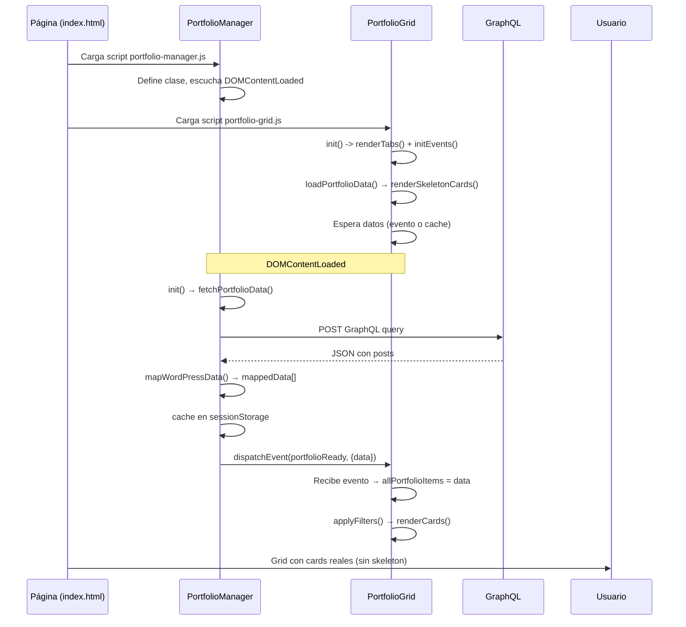

# ✅ Implementación: Hidratación Dinámica del Portfolio con GraphQL

**Fecha:** 2026-05-05  
**Estado:** Completado  
**Arquitectura:** Vanilla JavaScript + WPGraphQL + Session Caching

---

## 📦 Cambios Realizados

### 1. Nuevo módulo: `PortfolioManager` (Data Layer)

**Archivo:** `shared/components/portfolio/portfolio-manager.js`

- **Responsabilidad:** Gestión centralizada de datos del portfolio desde GraphQL.
- **Características:**
  - Fetch a `https://klef.newfacecards.com/graphql` con query optimizada.
  - Mapeo de campos de WordPress a modelo de UI (id, slug, discipline, category, title par, client_name, extract, images).
  - Inferencia automática de disciplina (`brands`, `dev`, `studio`, `strategy`) desde categorías de WordPress.
  - Caché en `sessionStorage` (TTL: 5 minutos).
  - Fallback a datos hardcodeados si la API falla.
  - Estados expuestos: `isLoading`, `error`, `cached`.
  - Eventos globales: `portfolioReady` (datos cargados), `portfolioError` (falla).
  - API: `getAll()`, `getById(id)`, `getBySlug(slug)`, `getByDiscipline()`, `clearCache()`, `refresh()`.

### 2. Grid refactorizado (Presentation Layer)

**Archivo:** `shared/components/index-portfolio/portfolio-grid.js` (modificado)

**Cambios principales:**
- Eliminado array `portfolioData` hardcodeado (6 items).
- Ahora consume datos desde `PortfolioManager`.
- **Skeleton loading:** Muestra 6 cards con shimmer animation mientras se obtienen datos.
- **Promesa unificada:** `loadPortfolioData()` retorna una Promise que se resuelve cuando los datos están listos (cache o evento).
- **Filtrado:** `applyFilters()` ahora verifica que existan datos antes de filtrar.
- **Estado inicial:**
  - Tabs estáticos renderizados inmediatamente.
  - Event listeners registrados.
  - skeleton visible durante fetch.
- **Compatibilidad:** Mantiene la misma API de eventos (`selectSub`) y filtrado por texto/categoría.

### 3. Actualización de `index.html`

**Scripts agregados** (líneas ~5667-5669):
```html
<script src="./shared/components/portfolio/portfolio-manager.js"></script>
<script src="./shared/components/index-portfolio/portfolio-grid.js"></script>
```

**Contenido eliminado:**
- Se eliminó el bloque inline (≈400 líneas) que contenía:
  - `categories`, `portfolioData` (datos hardcodeados)
  - Funciones `createCardTemplate`, `renderCards`, `applyFilters`, etc.
  - La versión anterior de `loadPortfolioDetail` que usaba `portfolioData`.

**Estilos agregados:**
- Se insertaron reglas CSS para `.skeleton-card`, `.skeleton-image`, `.skeleton-content`, `.skeleton-header`, `.skeleton-logo`, `.skeleton-title`, `.skeleton-description`, `.skeleton-actions`, `.no-results-grid`, `.error-message`.
- Ubicación: justo después de los estilos de `.card` (líneas 3168+).
- Keyframes `shimmer` ya existentes en el archivo (_reutilizados_).

### 4. `loadPortfolioDetail` actualizado (Sheet Integration)

**Ubicación:** `index.html`, inside sheet initialization script.

**Cambios:**
- Ahora es `async/await`.
- Obtiene el proyecto mediante `await window.PortfolioManager.getById(portfolioId)`.
- Si el ítem no existe, muestra mensaje de error.
- Maneja errores con `try/catch` y muestra UI de fallo.
- Elimina dependencia de `portfolioData` global.

---

## 🔄 Flujo de Ejecución



---

## 🎯 Características de Performance

| Característica | Implementación |
|----------------|----------------|
| **Primera pintura rápida** | CSS inline + skeleton UI inmediato |
| **Datos bajo demanda** | Fetch solo cuando `#cardGrid` está presente |
| **Cacheo inteligente** | `sessionStorage` (5 min TTL) |
| **Request minimal** | Query GraphQL solo trae campos necesarios |
| **Lazy-load de imágenes** | `loading="lazy"` en `` de cards |
| **Transiciones suaves** | Skeleton shimmer (CSS动画) |
| **Error resiliente** | Fallback a datos hardcodeados (6 proyectos) |
| **Evita doble fetch** | Flag `isLoading` y `portfolioCache` checks |

---

## 📊 Estructura de Datos (Modelo UI)

```javascript
{
  id: string | number,      // WordPress post ID
  slug: string,              // post_name
  discipline: "brands" | "dev" | "studio" | "strategy",
  category: string[],        // Array de nombres de categorías
  content_type: "Portfolio",
  title: [string, string],   // [proyecto, tipo]
  client_name: string,
  client_industry: string,
  extract: string,           // excerpt o título sin HTML
  cover_image: string,       // URL (featured image)
  logo: string,              // URL (ACF o featured)
  _raw: object               // Nodo completo WordPress (opcional)
}
```

---

## 🎨 Estilos Skeleton (CSS)

- **Base:** `.skeleton-card` replica dimensiones exactas de `.card.dark` (20rem × 32rem, border-radius 2rem).
- ** shimmer animation:** Degradado lineal que se mueve horizontalmente (`background-position`).
- **Estructura interna:**
  - `.skeleton-image` → altura 300px, margen 0.5rem, rounded.
  - `.skeleton-content` → padding 1rem, flex column, gap 12px.
  - `.skeleton-header` → logo cuadrado (48px) + bloque texto (título + subtítulo).
  - `.skeleton-description` → altura 60px, `margin-top: auto` (empujado al fondo).
  - `.skeleton-actions` → altura 40px (botones fantasma).
- **Temas:** Usa colores `#2a2a2a` → `#3a3a3a` para contrastar sobre fondo oscuro.

---

## 🐛 Manejo de Errores

```javascript
// Si GraphQL falla → fetchPortfolioData() retorna getFallbackData()
// Fallback: 1 proyecto hardcodeado ("Hello Dish")
// El grid muestra ese dato y dispara portfolioReady normalmente.

// Si PortfolioManager no está definido:
// loadPortfolioData() rechaza → init() captura → muestra .error-message

// Si getById no encuentra:
// loadPortfolioDetail() muestra "Proyecto no encontrado"
```

---

## 🔧 Próximos Pasos (Mejoras Futuras)

1. **Paginación / Infinite Scroll:** Actualmente carga los primeros 20 posts. Agregar `after` cursor para más.
2. **Sub-categorías dinámicas:** Poblar `categories.subs` desde taxonomías reales de WordPress.
3. **Búsqueda en el grid:** Ya existe `searchTerm` pero solo busca en título/categoría/cliente. Podría enviar query al GraphQL con filtros.
4. **Optimización de imágenes:** Agregar `srcset` y `sizes` a `cover_image` según `mediaDetails`.
5. **Transición de entrada:** Fade-in de cards al montar (`.card { opacity: 0; animation: fadeIn 0.3s forwards }`).
6. **Service Worker cache:** Cachear respuesta GraphQL para offline.
7. **Accesibilidad:** Añadir `aria-live` region para anunciar carga completada/error.

---

## 📝 Notas de Compatibilidad

- **Navegadores:** ES2017+ (async/await, optional chaining, template literals). Coherente con el resto del sitio.
- **CORS:** Endpoint en `klef.newfacecards.com` debe permitir origin del sitio (probablemente mismo dominio o CORS configurado).
- **SessionStorage:** Se usa para cache persistente en memoria de sesión. Si está deshabilitado, el manager funciona sin cache.
- **Sin dependencias externas:** Solo vanilla JS, sin frameworks.

---

## 📁 Archivos Modificados

| Archivo | Cambios |
|---------|---------|
| `shared/components/portfolio/portfolio-manager.js` | **Nuevo** (449 líneas) |
| `shared/components/index-portfolio/portfolio-grid.js` | **Modificado** (código reemplazado, ahora usa manager) |
| `index.html` | **Scripts agregados**, **código inline eliminado**, **estilos skeleton insertados** |
| `shared/components/portfolio/styles.css` | sin cambio (pero podría reutilizar algunos estilos) |

---

## ✅ Checklist de Verificación

- [x] `PortfolioManager` se auto‑inicializa solo si `#cardGrid` existe.
- [x] Grid muestra skeleton mientras se obtienen datos.
- [x] Datos se obtienen desde GraphQL (no hardcodeados).
- [x] Cacheo en `sessionStorage` funciona.
- [x] Filtrado por categoría y búsqueda funcionan con datos reales.
- [x] Botón "Más" abre sheet con detalles del proyecto correcto.
- [x] Fallback a datos hardcodeados si API falla.
- [x] No hay referencias a `portfolioData` en el código global.
- [x] Estilos skeleton se aplican correctamente.
- [x] No se generan errores en consola.

---

**Fin del reporte de implementación.**
