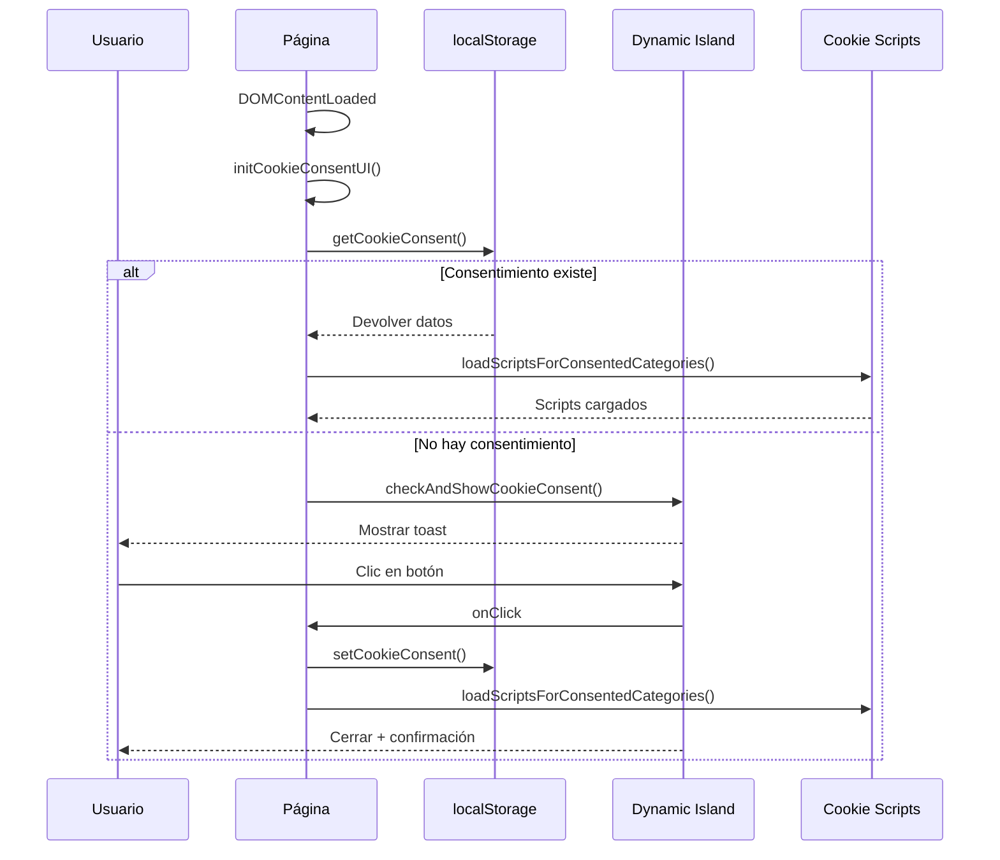

# Plan de Implementación del Sistema de Consentimiento de Cookies

## Resumen

Implementar un sistema completo de consentimiento de cookies integrado con el Dynamic Island, utilizando un modelo de datos estructurado, configuración modular de scripts y API centralizada.

## Arquitectura General

### 1. Modelo de Datos

Reemplazar las claves simples (`cookies_accepted`, `cookies_essential`) por un objeto JSON único en localStorage:

```json
{
  "version": 1,
  "timestamp": "2026-01-21T22:44:00Z",
  "categories": {
    "essential": true,
    "analytics": true,
    "marketing": false,
    "functional": false
  }
}
```

- **Clave**: `klef_cookie_consent`
- **Versionado**: Para futuras migraciones
- **Timestamp**: Para auditoría y expiración opcional
- **Categorías**: Booleanos por tipo de cookie

### 2. Configuración de Scripts (cookies.js)

Archivo dedicado con configuración de scripts por categoría:

```javascript
const KLEF_COOKIE_SCRIPTS = {
  analytics: [
    {
      id: "simple_analytics",
      load() {
        const s = document.createElement("script");
        s.src = "https://scripts.simpleanalyticscdn.com/latest.js";
        s.defer = true;
        document.head.appendChild(s);
      },
    },
    {
      id: "microsoft_clarity",
      load() {
        const s = document.createElement("script");
        s.innerHTML = `(function(c,l,a,r,i,t,y){ /* ... */ })(window, document, 'clarity','script','XXXX');`;
        document.head.appendChild(s);
      },
    },
  ],
  marketing: [
    {
      id: "calendly",
      load() {
        const s = document.createElement("script");
        s.src = "https://assets.calendly.com/assets/external/widget.js";
        s.async = true;
        document.head.appendChild(s);
      },
    },
  ],
};
```

**Ventajas**:

- Código nativo, auditable
- Sin strings HTML gigantes
- Fácil de mantener y actualizar

### 3. API Mínima (cookie-consent.js)

Funciones centralizadas para manejo de consentimiento:

```javascript
const KLEF_COOKIE_KEY = "klef_cookie_consent";

function getCookieConsent() {
  const raw = localStorage.getItem(KLEF_COOKIE_KEY);
  if (!raw) return null;
  try {
    return JSON.parse(raw);
  } catch {
    return null;
  }
}

function setCookieConsent(categories) {
  const data = {
    version: 1,
    timestamp: new Date().toISOString(),
    categories,
  };
  localStorage.setItem(KLEF_COOKIE_KEY, JSON.stringify(data));
  return data;
}

function loadScriptsForConsentedCategories(consent) {
  if (!consent || !consent.categories) return;
  Object.entries(consent.categories).forEach(([category, allowed]) => {
    if (!allowed) return;
    const group = KLEF_COOKIE_SCRIPTS[category];
    if (!group) return;
    group.forEach((scriptConfig) => {
      try {
        scriptConfig.load();
      } catch (e) {
        /* log opcional */
      }
    });
  });
}
```

### 4. Integración con Dynamic Island

Función principal que conecta UI con lógica:

```javascript
function initCookieConsentUI() {
  const consent = getCookieConsent();

  // Si ya hay consentimiento, cargar scripts y salir
  if (consent) {
    loadScriptsForConsentedCategories(consent);
    return;
  }

  // Si no hay, mostrar Dynamic Island
  checkAndShowCookieConsent();

  // Manejar clics en botones
  const buttons = document.querySelectorAll(".toast-action-btn");

  // Botón "Aceptar todas"
  if (buttons[0]) {
    buttons[0].addEventListener("click", () => {
      const consent = setCookieConsent({
        essential: true,
        analytics: true,
        marketing: true,
        functional: true,
      });
      loadScriptsForConsentedCategories(consent);
      // Cerrar toast + confirmación
    });
  }

  // Botón "Configurar/Solo esenciales"
  if (buttons[1]) {
    buttons[1].addEventListener("click", () => {
      const consent = setCookieConsent({
        essential: true,
        analytics: false,
        marketing: false,
        functional: false,
      });
      loadScriptsForConsentedCategories(consent);
      // Cerrar toast + confirmación
    });
  }
}
```

## Flujo Completo



## Tareas de Implementación

1. **Crear archivo `cookies.js`** con configuración de scripts por categoría
2. **Crear archivo `cookie-consent.js`** con API mínima
3. **Actualizar modelo de datos** en localStorage
4. **Modificar `initCookieConsentUI`** para integración
5. **Actualizar `showCookieConsent`** para nueva lógica
6. **Agregar llamada a `initCookieConsentUI`** en DOMContentLoaded
7. **Probar flujo completo**: Sin consentimiento → toast → aceptar todas → guardar y cargar
8. **Probar flujo esencial**: Configurar → guardar mínimas → cargar solo esenciales
9. **Agregar enlace opcional** en footer para reconfigurar
10. **Documentar** en `docs/cookie-consent-architecture.md`

## Consideraciones Técnicas

- **Categorías iniciales**: essential, analytics, marketing, functional
- **Scripts esenciales**: Asumir que siempre se cargan (navegación, etc.)
- **Error handling**: Try/catch en carga de scripts
- **Futuro**: Panel avanzado de configuración con toggles
- **Privacidad**: Respetar categorías en toda la aplicación

## Beneficios

- **Modular**: Scripts separados por categorías
- **Auditable**: Código nativo, no strings
- **Escalable**: Fácil agregar nuevas categorías/scripts
- **Conforme**: Modelo de datos estructurado para compliance
- **UX**: Integración seamless con Dynamic Island
