# Plan: Sistema de Carga Optimizada de Elementos Básicos

> **⚠️ INSTRUCCIÓN ESTRICTA:**
> **NO EDITAR `index.html` PARA HACER PRUEBAS DE ESTE DESARROLLO.**
> **CREAR UN ARCHIVO NUEVO PARA PRUEBAS.**
>
> Este sistema debe probarse de forma aislada para evitar romper la funcionalidad existente del sitio en producción.

---

## Reglas de Desarrollo

### Regla Principal

- **SIEMPRE** crear un archivo nuevo para pruebas (`load-basics-test.html` o similar)
- **NUNCA** modificar `index.html` directamente para pruebas
- Mantener `index.html` como referencia estable del sistema actual

### Archivos de Prueba Permitidos

- Ninguno, solo el archivo nuevo.

---

## Objetivo

Crear un sistema de configuración unificado (`global_setup`) que permita empaquetar, priorizar y cargar de forma ordenada los elementos básicos de cualquier página nueva del sitio web de Klef Agency.

---

## Estructura del `global_setup`

```javascript
const global_setup = {
  // === METADATOS ===
  version: '1.0.0',
  lastUpdated: '2026-02-10',
  description: 'Configuración unificada para carga optimizada de elementos básicos',

  // === CONFIGURACIÓN GLOBAL ===
  scope: 'site-wide',
  priority: 'critical',

  // === SETS DE ELEMENTOS ===
  sets: {
    icons: { ... },
    navigation: { ... },
    megaMenus: { ... }
  },

  // === ORDEN DE CARGA ===
  loadOrder: [ ... ],

  // === DEPENDENCIAS ===
  dependencies: { ... },

  // === ESTRATEGIA DE CARGA ===
  loadingStrategy: { ... }
};
```

---

## Detalle de Sets

### 1. Set de Iconos (`icons`)

```javascript
icons: {
  scope: 'global',
  priority: 1,
  description: 'Símbolos SVG para iconos del sitio',

  source: {
    file: '../../shared/utilities/icon-loader/svg-load.js',
    function: 'loadSVGIcons',
    target: '#icon-set'
  },

  attributes: {
    async: false,
    defer: false,
    type: 'text/javascript'
  },

  conditions: {
    alwaysLoad: true,
    requiredFor: ['navigation', 'megaMenus', 'search']
  },

  domTarget: '#icon-set',

  onComplete: function() {
    console.log('[Icons] SVG symbols loaded');
  }
}
```

**Iconos incluidos:**

- `icon-color-palette` - Diseño y Media
- `icon-code` - Tecnología
- `icon-megaphone` - Marketing
- `icon-search` - Búsqueda
- `phone` - Contacto
- `squircle-message` - Mensaje

---

### 2. Set de Navegación (`navigation`)

```javascript
navigation: {
  scope: 'global',
  priority: 2,
  description: 'Barra de navegación principal, topbar móvil y botones de control',

  components: [
    {
      id: 'mobile-topbar',
      selector: '.mobile-topbar',
      html: `
        <div class="mobile-topbar">
          <div data-logo="klef-logo-mobile">
            <a id="logo" href="/" class="no-image">
              
              Klef Agency
            </a>
          </div>
          <button class="close-btn toggle-menu" aria-label="Toggle menu"
                  data-action="toggle-menu">
            Menu
          </button>
        </div>
      `,
      styles: require('../mega-menu/mega-menu.css'),
      script: null,
      dependsOn: ['icons']
    },
    {
      id: 'mega-topbar',
      selector: '.mega-topbar',
      html: `
        <div class="mega-topbar">
          <button class="back-btn" data-action="go-back" aria-label="Volver al menú anterior">
            Volver
          </button>
          <button class="close-btn" data-action="close-menu"
                  aria-label="Cerrar menú de navegación">
            Cerrar
          </button>
        </div>
      `,
      styles: null,
      script: null,
      dependsOn: ['mobile-topbar']
    },
    {
      id: 'main-nav',
      selector: '#main-nav',
      html: `
        <nav class="navbar" id="main-nav">
          <div data-logo="klef-logo-desktop">
            <a id="logo" href="/" class="no-image">
              
              Klef Agency
            </a>
          </div>

          <div class="menu-links">
            <div class="section-label">MENÚ</div>

            <a href="#" data-mega="#Diseno" data-name="#Diseno"
               aria-label="Sección Diseño y Media">
              <span class="icon">
                <svg viewBox="0 0 24 24" fill="none" stroke="currentColor"
                     style="--wh: 20px; width: var(--wh); height: var(--wh)">
                  <use href="#icon-color-palette"></use>
                </svg>
              </span>
              <span class="label">Diseño y Media</span>
            </a>

            <a href="#" data-mega="#Tecnologia" data-name="#Tecnologia"
               aria-label="Sección Tecnología">
              <span class="icon">
                <svg viewBox="0 0 24 24" fill="none" stroke="currentColor"
                     style="--wh: 20px; width: var(--wh); height: var(--wh)">
                  <use href="#icon-code"></use>
                </svg>
              </span>
              <span class="label">Tecnología</span>
            </a>

            <a href="#" data-mega="#Marketing" data-name="#Marketing"
               aria-label="Sección Marketing">
              <span class="icon">
                <svg viewBox="0 0 24 24" fill="none" stroke="currentColor"
                     style="--wh: 20px; width: var(--wh); height: var(--wh)">
                  <use href="#icon-megaphone"></use>
                </svg>
              </span>
              <span class="label">Marketing</span>
            </a>
          </div>

          <div class="right-menu">
            <button class="btn-icon" data-action="open-search" aria-label="Buscar">
              <svg fill="none" stroke="currentColor" viewBox="0 0 24 24"
                   style="--wh: 20px; width: var(--wh); height: var(--wh)">
                <use href="#icon-search"></use>
              </svg>
            </button>
            <button class="btn-icon" data-action="open-contact-sheet" aria-label="Phone">
              <svg fill="none" stroke="currentColor" viewBox="0 0 24 24">
                <use href="#phone"></use>
              </svg>
              <div class="vertical-line"></div>
              <svg fill="none" stroke="currentColor" viewBox="0 0 24 24">
                <use href="#squircle-message"></use>
              </svg>
            </button>
          </div>
        </nav>
      `,
      styles: require('../mega-menu/mega-menu.css'),
      script: null,
      dependsOn: ['icons']
    }
  ],

  styles: {
    file: '../mega-menu/mega-menu.css',
    critical: true
  },

  script: {
    file: '../navigation/navigation-system.js',
    module: false
  },

  conditions: {
    alwaysLoad: true
  }
}
```

---

### 3. Set de Mega Menús (`megaMenus`)

```javascript
megaMenus: {
  scope: 'global',
  priority: 3,
  description: 'Contenedor de mega menús para las tres secciones principales',

  container: {
    selector: '.mega-menus-container',
    html: `
      <div class="mega-menus-container">
        <!-- Diseño y Media -->
        <div class="mega-menu" id="Diseno">
          <div class="mega-content">
            <div class="mega-sidebar">
              <div class="mega-sidebar-title">Diseño y Media</div>
              <a href="#" aria-label="Ver proyectos de Branding">
                <span>Branding</span>
                <svg fill="none" stroke="currentColor" viewBox="0 0 24 24">
                  <path stroke-linecap="round" stroke-linejoin="round" stroke-width="2"
                        d="M9 5l7 7-7 7" />
                </svg>
              </a>
              <a href="#" aria-label="Ver proyectos de Studio Multimedia">
                <span>Studio Multimedia</span>
                <svg fill="none" stroke="currentColor" viewBox="0 0 24 24">
                  <path stroke-linecap="round" stroke-linejoin="round" stroke-width="2"
                        d="M9 5l7 7-7 7" />
                </svg>
              </a>
              <a href="#" aria-label="Ver proyectos de Publicidad">
                <span>Publicidad</span>
                <svg fill="none" stroke="currentColor" viewBox="0 0 24 24">
                  <path stroke-linecap="round" stroke-linejoin="round" stroke-width="2"
                        d="M9 5l7 7-7 7" />
                </svg>
              </a>
            </div>
            <div class="mega-main">
              <div class="mega-featured">
                <div class="featured-image">🎨</div>
                <div class="featured-content">
                  <div class="featured-tag">By Klef•Brand</div>
                  <h3>Branding</h3>
                  <p>Descubre las marcas que hemos desarrollado y nuestras estrategias de diseño</p>
                  <a href="#" class="btn-primary">Ir a Brands</a>
                </div>
              </div>
            </div>
          </div>
        </div>

        <!-- Tecnología -->
        <div class="mega-menu" id="Tecnologia">
          <div class="mega-content">
            <div class="mega-sidebar">
              <div class="mega-sidebar-title">Tecnología</div>
              <a href="#" aria-label="Ver proyectos de Desarrollo Web">
                <span>Desarrollo Web</span>
                <svg fill="none" stroke="currentColor" viewBox="0 0 24 24">
                  <path stroke-linecap="round" stroke-linejoin="round" stroke-width="2"
                        d="M9 5l7 7-7 7" />
                </svg>
              </a>
              <a href="#" aria-label="Ver proyectos de Apps Móviles">
                <span>Apps Móviles</span>
                <svg fill="none" stroke="currentColor" viewBox="0 0 24 24">
                  <path stroke-linecap="round" stroke-linejoin="round" stroke-width="2"
                        d="M9 5l7 7-7 7" />
                </svg>
              </a>
              <a href="#" aria-label="Ver proyectos de E-commerce">
                <span>E-commerce</span>
                <svg fill="none" stroke="currentColor" viewBox="0 0 24 24">
                  <path stroke-linecap="round" stroke-linejoin="round" stroke-width="2"
                        d="M9 5l7 7-7 7" />
                </svg>
              </a>
            </div>
            <div class="mega-main">
              <div class="mega-featured">
                <div class="featured-image" style="background: linear-gradient(135deg, #c0e8ff, #a3c7ff)">
                  
                </div>
                <div class="featured-content">
                  <div class="featured-tag">By Klef•Tech</div>
                  <h3>Desarrollo Web</h3>
                  <p>Soluciones tecnológicas modernas y escalables para tu negocio</p>
                  <a href="#" class="btn-primary">Ver Proyectos</a>
                </div>
              </div>
            </div>
          </div>
        </div>

        <!-- Marketing -->
        <div class="mega-menu" id="Marketing">
          <div class="mega-content">
            <div class="mega-sidebar">
              <div class="mega-sidebar-title">Marketing</div>
              <a href="#" aria-label="Ver proyectos de Social Media">
                <span>Social Media</span>
                <svg fill="none" stroke="currentColor" viewBox="0 0 24 24">
                  <path stroke-linecap="round" stroke-linejoin="round" stroke-width="2"
                        d="M9 5l7 7-7 7" />
                </svg>
              </a>
              <a href="#" aria-label="Ver estrategias SEO/SEM">
                <span>SEO/SEM</span>
                <svg fill="none" stroke="currentColor" viewBox="0 0 24 24">
                  <path stroke-linecap="round" stroke-linejoin="round" stroke-width="2"
                        d="M9 5l7 7-7 7" />
                </svg>
              </a>
              <a href="#" aria-label="Ver estrategias de Content Strategy">
                <span>Content Strategy</span>
                <svg fill="none" stroke="currentColor" viewBox="0 0 24 24">
                  <path stroke-linecap="round" stroke-linejoin="round" stroke-width="2"
                        d="M9 5l7 7-7 7" />
                </svg>
              </a>
            </div>
            <div class="mega-main">
              <div class="mega-featured">
                <div class="featured-image" style="background: linear-gradient(135deg, #d4f1d4, #a3e6a3)">
                  
                </div>
                <div class="featured-content">
                  <div class="featured-tag">By Klef•Marketing</div>
                  <h3>Marketing Digital</h3>
                  <p>Estrategias data-driven para impulsar tu presencia online</p>
                  <a href="#" class="btn-primary">Conocer Más</a>
                </div>
              </div>
            </div>
          </div>
        </div>
      </div>
    `
  },

  styles: {
    file: '../mega-menu/mega-menu.css',
    critical: false,
    lazy: true
  },

  script: {
    file: '../mega-menu/mega-menu.js',
    module: false,
    lazy: true
  },

  conditions: {
    alwaysLoad: true,
    dependsOn: ['navigation']
  },

  lazyLoad: {
    enabled: true,
    trigger: 'interaction',
    events: ['mouseenter', 'touchstart', 'focus']
  }
}
```

---

## Orden de Carga (`loadOrder`)

```javascript
loadOrder: [
  {
    step: 1,
    set: "icons",
    strategy: "blocking",
    reason: "Los iconos son necesarios para la navegación y mega-menús",
  },
  {
    step: 2,
    set: "navigation",
    strategy: "blocking",
    reason: "La navegación es crítica para la UX inicial",
  },
  {
    step: 3,
    set: "megaMenus",
    strategy: "lazy",
    trigger: "user-interaction",
    reason: "Los mega-menús se cargan solo cuando el usuario interactúa",
  },
];
```

---

## Dependencias (`dependencies`)

```javascript
dependencies: {
  icons: {
    requiredBy: ['navigation', 'megaMenus'],
    reason: 'SVG symbols para iconos'
  },

  navigation: {
    requiredBy: ['megaMenus'],
    reason: 'Contenedor y eventos de navegación'
  },

  scrollLock: {
    source: '../../assets/scripts/scroll-lock.js',
    requiredBy: ['navigation'],
    reason: 'Bloqueo de scroll para móvil'
  }
}
```

---

## Estrategia de Carga (`loadingStrategy`)

```javascript
loadingStrategy: {
  mode: 'progressive',

  critical: {
    description: 'Elementos que deben cargarse inmediatamente',
    items: ['icons', 'navigation'],
    method: 'blocking'
  },

  deferred: {
    description: 'Elementos que pueden cargarse después del render inicial',
    items: ['megaMenus'],
    method: 'lazy',
    threshold: 'interaction'
  },

  optimizations: {
    minifyHTML: true,
    inlineCriticalCSS: true,
    deferNonCriticalScripts: true,
    preloadFonts: ['Inter', 'Google Sans']
  }
}
```

---

## Estructura del Loader

```javascript
// shared/components/loader/basics-loader.js

class BasicsLoader {
  constructor(config = global_setup) {
    this.config = config;
    this.loadedSets = new Set();
    this.queue = [];
  }

  async load(setName) {
    if (this.loadedSets.has(setName)) {
      return Promise.resolve();
    }

    const set = this.config.sets[setName];
    if (!set) {
      console.error(`[BasicsLoader] Set no encontrado: ${setName}`);
      return Promise.reject(new Error(`Set not found: ${setName}`));
    }

    // Cargar dependencias primero
    if (set.dependsOn) {
      await Promise.all(set.dependsOn.map((dep) => this.load(dep)));
    }

    // Cargar estilos
    if (set.styles) {
      await this.loadStyles(set.styles);
    }

    // Insertar HTML
    if (set.html || set.container) {
      this.insertHTML(set.html || set.container);
    }

    // Cargar scripts
    if (set.script) {
      await this.loadScript(set.script);
    }

    this.loadedSets.add(setName);

    if (set.onComplete) {
      set.onComplete();
    }
  }

  async loadAll() {
    for (const step of this.config.loadOrder) {
      await this.load(step.set);
    }
  }

  async loadStyles(stylesConfig) {
    // Implementación de carga de estilos
  }

  insertHTML(html) {
    // Implementación de inserción de HTML
  }

  async loadScript(scriptConfig) {
    // Implementación de carga de scripts
  }
}

export default BasicsLoader;
```

---

## Uso en HTML (Archivo de Prueba)

```html
<!-- load-basics-test.html - USAR ESTE ARCHIVO PARA PRUEBAS, NO index.html -->

<!doctype html>
<html lang="es">
  <head>
    <meta charset="UTF-8" />
    <meta name="viewport" content="width=device-width, initial-scale=1.0" />
    <title>Test: Sistema de Carga Optimizada - Klef Agency</title>
  </head>
  <body>
    <!-- Container para iconos -->
    <div id="icon-set"></div>

    <!-- Carga del loader con configuración global -->
    <script type="module">
      import BasicsLoader from "./shared/components/loader/basics-loader.js";

      const loader = new BasicsLoader(global_setup);

      // Cargar elementos críticos inmediatamente
      await loader.loadAll();

      // Opcional: precargar mega-menús en hover
      document.querySelectorAll("[data-mega]").forEach((item) => {
        item.addEventListener(
          "mouseenter",
          async () => {
            await loader.load("megaMenus");
          },
          { once: true },
        );
      });
    </script>
  </body>
</html>
```

---

## Diagrama de Flujo de Carga

```mermaid
flowchart TD
    A[Inicio] --> B[Cargar Icons<br/>priority: 1]
    B --> C{Cargas exitosa?}
    C -->|No| D[Retry 3x]
    C -->|Sí| E[Cargar Navigation<br/>priority: 2]
    E --> F{Cargas exitosa?}
    F -->|No| G[Fallback: Styles inline]
    F -->|Sí| H[MegaMenus<br/>priority: 3<br/>lazy: true]
    H --> I[Esperar interacción<br/>mouseenter/touchstart]
    I --> J[Cargar contenido<br/>mega-menu HTML]
    J --> K[Inicializar<br/>event listeners]

    style A fill:#e1f5fe
    style B fill:#fff3e0
    style E fill:#fff3e0
    style H fill:#e8f5e9
```



---

## Próximos Pasos

1. **Crear archivo de pruebas** (`load-basics-test.html`)
2. **Crear archivo de configuración** (`global-setup.js`)
3. **Implementar BasicsLoader** class
4. **Refactorizar estilos** a archivo externo
5. **Migrar HTML** a templates modulares
6. **Implementar lazy loading** para mega-menús
7. **Testing** en archivo de pruebas
8. **Validar** sin modificar `index.html`

---

## Resumen de Reglas

| Regla             | Descripción                                      |
| ----------------- | ------------------------------------------------ |
| **NO EDITAR**     | `index.html` nunca debe modificarse para pruebas |
| **SIEMPRE CREAR** | Nuevo archivo para cada prueba                   |
| **AISLAR**        | Mantener el sistema de producción intacto        |
| **DOCUMENTAR**    | Registrar cambios y resultados en este plan      |
