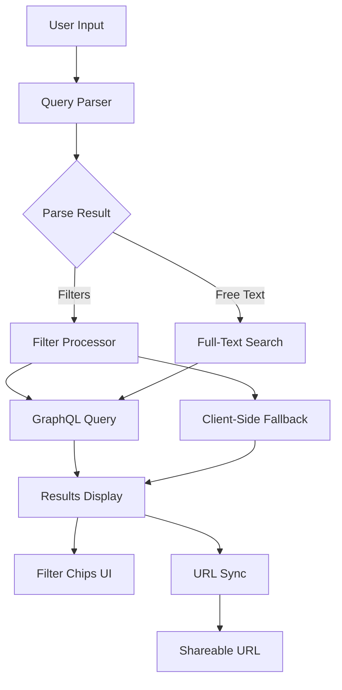
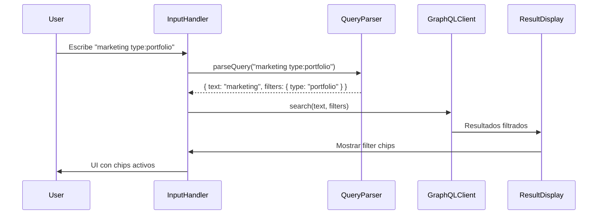

# Plan: Search Filter System with key:value Syntax

## Resumen

Implementar un sistema de filtros avanzados basado en la sintaxis `key:value` (cuasi-estándar) para el search overlay de Klef. Este sistema permitirá a los usuarios combinar búsqueda de texto libre con filtros estructurados.

## Arquitectura del Sistema



## Componentes del Sistema

### 1. Query Parser (`query-parser.js`)

Módulo dedicado a parsear la sintaxis `key:value`:

```javascript
// Entrada
"marketing type:portfolio after:2024-01-01 -draft"

// Salida estructurada
{
  text: "marketing",
  filters: {
    type: "portfolio",
    after: "2024-01-01"
  },
  exclude: ["draft"]
}
```

#### Reglas de Parsing

| Patrón              | Descripción          | Ejemplo             |
| ------------------- | -------------------- | ------------------- |
| `key:value`         | Filtro estructurado  | `type:portfolio`    |
| `-key:value`        | Exclusión            | `-type:draft`       |
| `"phrase"`          | Frase exacta         | `"cabo san lucas"`  |
| `-word`             | Exclusión de palabra | `-draft`            |
| `after:YYYY-MM-DD`  | Fecha posterior      | `after:2024-01-01`  |
| `before:YYYY-MM-DD` | Fecha anterior       | `before:2024-12-31` |

### 2. Filter Schema (`filter-config.js`)

Configuración de filtros soportados:

```javascript
export const FILTER_CONFIG = {
  type: {
    keys: ["type", "t"],
    values: ["page", "blog", "portfolio", "post"],
    description: "Filtrar por tipo de contenido",
  },
  category: {
    keys: ["category", "cat", "c"],
    values: [], // Se llenan dinámicamente desde GraphQL
    description: "Filtrar por categoría",
  },
  tag: {
    keys: ["tag", "tag"],
    values: [],
    description: "Filtrar por etiqueta",
  },
  author: {
    keys: ["author", "by", "owner"],
    values: ["me"],
    description: "Filtrar por autor",
  },
  after: {
    keys: ["after"],
    type: "date",
    description: "Contenido posterior a esta fecha",
  },
  before: {
    keys: ["before"],
    type: "date",
    description: "Contenido anterior a esta fecha",
  },
  is_client: {
    keys: ["author:is_client"],
    description: "Mostrar solo proyectos de clientes",
  },
};
```

### 3. Flujo de Búsqueda Modificado



## Implementación por Fase

### Fase 1: Parser y Configuración

1. **Crear `query-parser.js`**
   - Regex para detectar `key:value`
   - Manejo de comillas para frases
   - Soporte para negación `-`
   - Validación de fechas

2. **Crear `filter-config.js`**
   - Definir todos los filtros soportados
   - Valores permitidos para cada filtro
   - Descripciones para autocompletado

### Fase 2: Integración con Search System

1. **Modificar `search-system.js`**
   - Importar parser y config
   - Llamar parser antes de GraphQL query
   - Pasar filtros extraídos a la query

2. **Actualizar GraphQL Query**
   - Añadir parámetros de filtros si el endpoint los soporta
   - Si no, implementar filtrado client-side

### Fase 3: UI de Filtros

1. **Filter Chips**
   - Mostrar filtros activos como chips
   - Botón `-` para remover filtros individuales
   - Botón "Clear all" cuando hay filtros

2. **Autocompletado**
   - Detectar `:` y mostrar sugerencias de claves
   - Después de `type:`, mostrar valores posibles

3. **Highlighting**
   - Resaltar sintaxis de filtros en el input
   - Diferenciar texto libre de filtros

### Fase 4: URL State Sync

1. **Sincronización**
   - Escribir filtros al URL: `?q=marketing&type=portfolio&after=2024-01-01`
   - Leer parámetros al cargar la página
   - Restaurar estado de filtros

2. **Shareable URLs**
   - Permitir copiar URL con filtros activos
   - Abrir búsqueda con filtros desde URL

## Ejemplos de Uso

| Query                             | Resultado                               |
| --------------------------------- | --------------------------------------- |
| `marketing`                       | Buscar "marketing" en todo el contenido |
| `type:portfolio`                  | Solo proyectos de portfolio             |
| `marketing type:portfolio`        | "marketing" en portfolio                |
| `type:portfolio after:2024-01-01` | Portfolio desde 2024                    |
| `cabo type:blog -draft`           | Posts sobre cabo, sin borradores        |
| `"cabo san lucas"`                | Frase exacta                            |
| `author:is_client`                | Solo proyectos de clientes              |

## Archivos a Modificar/Crear

| Archivo                                     | Acción          | Descripción                  |
| ------------------------------------------- | --------------- | ---------------------------- |
| `shared/components/search/query-parser.js`  | Crear           | Parser de sintaxis key:value |
| `shared/components/search/filter-config.js` | Crear           | Configuración de filtros     |
| `shared/components/search/search-system.js` | Modificar       | Integrar parser y filtros    |
| `index.html`                                | Modificar       | Añadir CSS para filter chips |
| `assets/styles/search.css`                  | Crear/Modificar | Estilos para UI de filtros   |

## Checklist de Testing

- [ ] Parser extrae correctamente `key:value`
- [ ] Negación `-` funciona
- [ ] Fechas `after:` y `before:` se validan
- [ ] Frases entre comillas funcionan
- [ ] Filtros combinan con texto libre
- [ ] Filter chips se muestran correctamente
- [ ] Remover filtros individuales funciona
- [ ] URL sync funciona bidireccionalmente
- [ ] Autocompletado sugiere claves correctas
- [ ] Resultados se filtran correctamente
