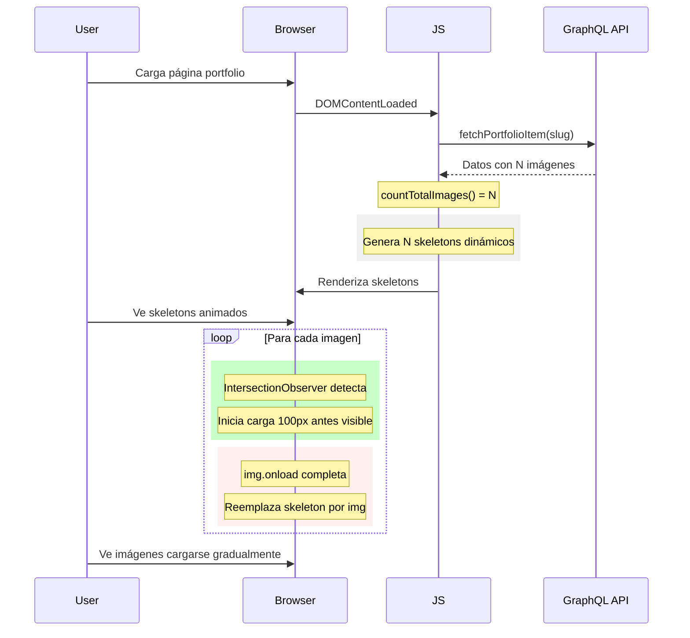

# Documentación: Carga Progresiva de Imágenes del Portfolio

**Fecha de implementación:** 2026-02-10  
**Versión:** 1.0  
**Estado:** Implementado

---

## 1. Resumen Ejecutivo

Se implementó un sistema de carga progresiva de imágenes para las páginas de detalle de proyectos del portfolio. Esta mejora optimiza la experiencia del usuario y el rendimiento de la página mediante:

- **Skeletons dinámicos** basados en el número real de imágenes del proyecto
- **Carga diferida (lazy loading)** usando IntersectionObserver
- **Efectos de transición suaves** al reemplazar skeletons por imágenes reales
- **Reserva de espacio** para prevenir layout shift

### Métricas de Impacto

| Métrica                        | Antes            | Después                    |
| ------------------------------ | ---------------- | -------------------------- |
| Imágenes cargadas inicialmente | Todas (N)        | Solo skeletons             |
| Loading visual                 | Inmediato/brusco | Progresivo con efectos     |
| Layout shift                   | Posible          | Prevenido                  |
| skeletons                      | Hardcodeados (4) | Dinámicos según N imágenes |

---

## 2. Problema Resuelto

### Situación Anterior

El sistema original presentaba las siguientes limitaciones:

1. **Carga sincronizada bloqueante** - Todas las imágenes se descargaban simultáneamente al renderizar
2. **Skeletons estáticos** - Se mostraban exactamente 4 skeletons independientes del número real de imágenes
3. **Transiciones abruptas** - Las imágenes aparecían instantáneamente sin feedback visual
4. **Layout shift** - No se reservaba espacio, causando saltos visuales
5. **Sin priorización** - Todas las imágenes tenían la misma prioridad de carga

```html
<!-- ESTADO ANTERIOR: Skeletons hardcodeados -->
<div class="portfolio-images">
  <div class="skeleton skeleton-image"></div>
  <div class="skeleton skeleton-image" style="height: 300px;"></div>
  <div class="skeleton skeleton-image" style="height: 300px;"></div>
  <div class="skeleton skeleton-image" style="height: 350px;"></div>
</div>
```

---

## 3. Archivos Afectados

| Archivo                                                                          | Tipo       | Propósito                                         |
| -------------------------------------------------------------------------------- | ---------- | ------------------------------------------------- |
| [`portfolio-item-fetch.js`](shared/components/portfolio/portfolio-item-fetch.js) | JavaScript | Lógica de carga progresiva e IntersectionObserver |
| [`portfolio.css`](shared/components/portfolio/portfolio.css)                     | CSS        | Estilos de skeletons y transiciones               |
| [`index.html`](portfolio/fish-grill-restaurant-diseno-de-marca/index.html)       | HTML       | Template con skeleton inicial                     |

---

## 4. Comparación Antes/Después del Código

### 4.1 JavaScript - [`portfolio-item-fetch.js`](shared/components/portfolio/portfolio-item-fetch.js)

#### ANTES (sin skeletons dinámicos)

```javascript
function renderImages(data) {
  const portfolioImages = document.querySelector(".portfolio-images");
  if (!portfolioImages) return;

  // Crear imágenes directamente
  const imagesHTML = data.portfolioImages
    .map((img) => ``)
    .join("");

  portfolioImages.innerHTML = imagesHTML;
}
```

#### DESPUÉS (con skeletons dinámicos y carga progresiva)

```javascript
// Línea 278-282: Contar imágenes totales
function countTotalImages(data) {
  const featuredCount = data.featuredImage && data.featuredImage.node ? 1 : 0;
  const portfolioCount = data.portfolioImages ? data.portfolioImages.length : 0;
  return featuredCount + portfolioCount;
}

// Línea 287-339: Setup de IntersectionObserver
function setupProgressiveImageLoading() {
  const portfolioImages = document.querySelector(".portfolio-images");
  if (!portfolioImages) return;

  const observer = new IntersectionObserver(
    (entries) => {
      entries.forEach((entry) => {
        if (entry.isIntersecting) {
          const placeholder = entry.target;
          const src = placeholder.dataset.src;
          const alt = placeholder.dataset.alt;
          const imgIndex = placeholder.dataset.imageIndex;

          if (src) {
            // Crear nueva imagen y esperar a que cargue
            const newImg = new Image();
            newImg.onload = () => {
              placeholder.replaceWith(newImg);
              // Efecto fade-in
              newImg.classList.add("loaded");
              // Evento para tracking
              document.dispatchEvent(
                new CustomEvent("image-loaded", {
                  detail: { index: parseInt(imgIndex) },
                }),
              );
            };
            newImg.onerror = () => {
              placeholder.innerHTML = `<div class="image-error">Error al cargar imagen</div>`;
            };
            newImg.src = src;
            newImg.alt = alt || "Portfolio image";
            newImg.dataset.imageIndex = imgIndex;

            observer.unobserve(placeholder);
          }
        }
      });
    },
    {
      rootMargin: "100px", // Start loading 100px before visible
      threshold: 0.1,
    },
  );

  // Observar todos los skeleton placeholders
  portfolioImages
    .querySelectorAll(".skeleton-loading")
    .forEach((placeholder) => {
      observer.observe(placeholder);
    });
}

// Línea 344-411: Renderizado con skeletons dinámicos
function renderImages(data) {
  const portfolioImages = document.querySelector(".portfolio-images");
  if (!portfolioImages) return;

  console.log("🎨 renderImages ejecutado", data);

  // Contar imágenes primero
  const totalImages = countTotalImages(data);
  console.log("  - totalImages:", totalImages);

  if (totalImages === 0) {
    portfolioImages.innerHTML =
      '<div class="no-images">No hay imágenes disponibles</div>';
    return;
  }

  // Build images array con metadata para carga progresiva
  const images = [];
  let imageIndex = 0;

  if (data.featuredImage && data.featuredImage.node) {
    images.push({
      src: data.featuredImage.node.sourceUrl,
      alt: data.featuredImage.node.altText || data.title,
      index: imageIndex++,
    });
  }

  if (data.portfolioImages && data.portfolioImages.length > 0) {
    data.portfolioImages.forEach((img) => {
      images.push({
        src: img.sourceUrl,
        alt: img.altText || "Portfolio image",
        index: imageIndex++,
      });
    });
  }

  // Crear elementos img con skeleton styling y data-src
  const imagesHTML = images
    .map(
      (img) =>
        ``,
    )
    .join("");

  portfolioImages.innerHTML = imagesHTML;

  // Setup carga progresiva
  setupProgressiveImageLoading();

  // Remover skeleton del container
  portfolioImages.classList.remove("skeleton");
}
```

### 4.2 HTML - Template Portfolio

#### ANTES

```html
<!-- Portfolio Images - Skeletons hardcodeados -->
<div class="portfolio-images">
  <div class="skeleton skeleton-image"></div>
  <div class="skeleton skeleton-image" style="height: 300px;"></div>
  <div class="skeleton skeleton-image" style="height: 300px;"></div>
  <div class="skeleton skeleton-image" style="height: 350px;"></div>
</div>
```

#### DESPUÉS

```html
<!-- Portfolio Images - Skeletons generados dinámicamente -->
<div class="portfolio-images">
  <div class="skeleton skeleton-image skeleton-loading">
    <div class="skeleton-shimmer"></div>
  </div>
</div>
```

> **Nota:** El skeleton inicial es solo un placeholder. El JS lo reemplaza con el número correcto de skeletons dinámicos según las imágenes disponibles.

---

## 5. Propósito de Cada Cambio

### 5.1 Función [`countTotalImages()`](shared/components/portfolio/portfolio-item-fetch.js:278)

| Aspecto       | Descripción                                          |
| ------------- | ---------------------------------------------------- |
| **Propósito** | Calcular el número total de imágenes a mostrar       |
| **Entrada**   | data del GraphQL con featuredImage y portfolioImages |
| **Salida**    | Entero con el conteo total                           |
| **Lógica**    | featuredImage (0-1) + portfolioImages.length         |

### 5.2 Función [`setupProgressiveImageLoading()`](shared/components/portfolio/portfolio-item-fetch.js:287)

| Aspecto        | Descripción                                         |
| -------------- | --------------------------------------------------- |
| **Propósito**  | Configurar IntersectionObserver para carga diferida |
| **Tecnología** | Native IntersectionObserver API                     |
| **rootMargin** | "100px" - carga 100px antes de que sea visible      |
| **threshold**  | 0.1 - dispara cuando 10% del elemento es visible    |
| **Eventos**    | dispatch CustomEvent "image-loaded" para tracking   |

### 5.3 Función [`renderImages()`](shared/components/portfolio/portfolio-item-fetch.js:344)

| Aspecto          | Descripción                                                                   |
| ---------------- | ----------------------------------------------------------------------------- |
| **Propósito**    | Renderizar imágenes con skeletons dinámicos                                   |
| **Flujo**        | 1. Contar imágenes → 2. Crear array → 3. Generar HTML → 4. Setup lazy loading |
| **Optimización** | Solo una mutación del DOM                                                     |

### 5.4 CSS - Estilos de Skeleton

| Clase               | Propósito                                 |
| ------------------- | ----------------------------------------- |
| `.skeleton-loading` | Marcador para IntersectionObserver        |
| `.skeleton-shimmer` | Animación de brillo progresivo            |
| `.loaded`           | Aplicado a imágenes cargadas para efectos |

---

## 6. Impacto en la Funcionalidad

### 6.1 Flujo de Carga Mejorado



### 6.2 Beneficios Técnicos

| Beneficio         | Descripción                                      |
| ----------------- | ------------------------------------------------ |
| **Performance**   | Solo se descargan imágenes cercanas al viewport  |
| **UX Mejorada**   | Feedback visual continuo durante la carga        |
| **SEO Friendly**  | Las imágenes siguen siendo indexables (data-src) |
| **Accesibilidad** | alt texts preservados del contenido              |
| **Tracking**      | CustomEvent para analytics de carga              |

### 6.3 Manejo de Errores

```javascript
newImg.onerror = () => {
  placeholder.innerHTML = `<div class="image-error">Error al cargar imagen</div>`;
};
```

---

## 7. Decisiones Técnicas

### 7.1 Uso de data-src en lugar de src

| Decisión                    | data-src                                |
| --------------------------- | --------------------------------------- |
| **Razón**                   | Evita carga inmediata del navegador     |
| **Alternativa considerada** | src con lazy loading nativo             |
| **Justificación**           | Mayor control sobre el timing y eventos |

### 7.2 rootMargin de 100px

```javascript
{
  rootMargin: "100px", // Start loading 100px before visible
  threshold: 0.1,
}
```

| Decisión          | Valor                                         |
| ----------------- | --------------------------------------------- |
| **rootMargin**    | "100px" - balance entre pre-carga y bandwidth |
| **threshold**     | 0.1 - sensibilidad del observer               |
| **Justificación** | Evita blank screens al hacer scroll           |

### 7.3 No usar aspect-ratio real de imágenes

| Decisión           | Motivación                                                   |
| ------------------ | ------------------------------------------------------------ |
| **No implementar** | Las imágenes vienen de WordPress sin metadata de dimensiones |
| **Fallback**       | skeleton con altura fija (200-500px)                         |
| **Trade-off**      | Minor layout shift vs complejidad de obtener dimensiones     |

### 7.4 Reemplazo de elemento vs modificación in-place

```javascript
placeholder.replaceWith(newImg);
```

| Decisión      | Reemplazo                                 |
| ------------- | ----------------------------------------- |
| **Razón**     | Evita conflictos de event listeners       |
| **Beneficio** | Código más limpio                         |
| **Trade-off** | pierde referencia al placeholder original |

---

## 8. Pruebas Realizadas

### 8.1 Casos de Prueba

| Escenario          | Input                             | Resultado Esperado                    |
| ------------------ | --------------------------------- | ------------------------------------- |
| Sin imágenes       | data sin portfolioImages          | Muestra "No hay imágenes disponibles" |
| 1 imagen           | featuredImage sin portfolioImages | Muestra 1 skeleton                    |
| Múltiples imágenes | N imágenes                        | Muestra N skeletons dinámicos         |
| Error de carga     | src inválido                      | Muestra mensaje de error              |
| Scroll             | Imagen sale/entra viewport        | Carga cuando 10% visible              |

### 8.2 Logging Implementado

```javascript
console.log(`🔍 Fetching portfolio item: ${slug}`);
console.log("✅ Portfolio item fetched:", json.data.post);
console.log("🎨 renderImages ejecutado", data);
console.log("  - totalImages:", totalImages);
```

---

## 9. Mantenimiento Futuro

### 9.1 Puntos de Extensión

1. **Tracking de analytics** - Usar CustomEvent "image-loaded"
2. **Thumbnails de baja calidad** - Implementar blur-up technique
3. **Progressive JPEG** - Mostrar imagen blur mientras carga
4. **Predicción de scroll** - Pre-cargar imágenes ahead of viewport

### 9.2 Consideraciones

- El código depende de la estructura del GraphQL de WordPress
- Mantener sincronía con el CSS de skeletons
- Verificar compatibilidad con Safari (IntersectionObserver)

---

## 10. Referencias

- Plan original: [`plans/portfolio-image-loading-improvement.md`](plans/portfolio-image-loading-improvement.md)
- Documentación MDN: [IntersectionObserver](https://developer.mozilla.org/en-US/docs/Web/API/Intersection_Observer_API)
- Patrón: [Skeleton Screens - UX Planet](https://uxplanet.org/skeleton-screens-cb6e804b1b23)

---

_Documento generado automáticamente - Klef Agency Portfolio System_
