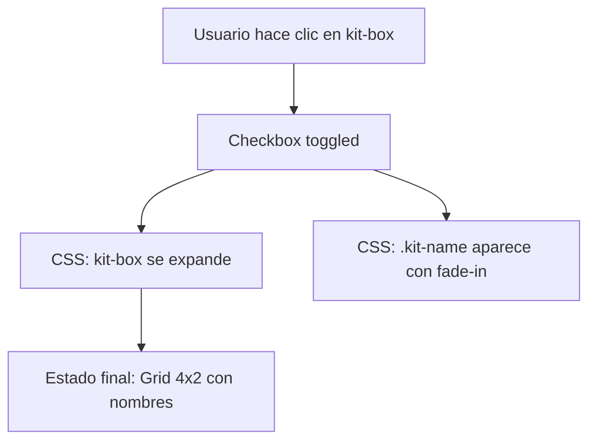

# Plan: Expansión de kit-box como folder-container

## Objetivo

Transformar el elemento `.kit-box` en `lab-kits/kit-item.html` para que se comporte como `.folder-container` en `lab-kits/kit-box-transition.html`, permitiendo expansión al hacer clic para mostrar los módulos con sus nombres.

## Análisis Comparativo

| Aspecto     | kit-box (actual)    | folder-container (referencia) |
| ----------- | ------------------- | ----------------------------- |
| Tamaño      | 110x110px           | 160x160px → 340x380px         |
| Grid        | 2x2 (fijo)          | 2x2 → 4x2                     |
| Elementos   | 4 letras (S,O,D,A)  | 4 → 8 iconos                  |
| Interacción | Click → openSheet() | Click → Toggle checkbox       |
| Transición  | Ninguna             | Elastic bezier + delays       |
| Nombres     | No muestra          | Muestra con fade-in           |

## Cambios Requeridos

### 1. HTML - Agregar Checkbox de Control

```html
<!-- Agregar antes del scroll-area -->
<input type="checkbox" id="kit-toggle" />

<!-- Modificar kit-box para ser label + contenido expandido -->
<div
  class="kit-box"
  onclick="event.preventDefault(); document.getElementById('kit-toggle').click()"
>
  <!-- Elementos existentes (S, O, D, A) -->
  <div class="c">S</div>
  <div class="c">O</div>
  <div class="c">D</div>
  <div class="c">A</div>

  <!-- Nuevos: Nombres de módulos (ocultos inicialmente) -->
  <div class="kit-name">SEO Tech</div>
  <div class="kit-name">Optimization</div>
  <div class="kit-name">Design</div>
  <div class="kit-name">Analytics</div>
</div>
```

### 2. CSS - Nuevos Estilos

```css
/* Checkbox oculto */
#kit-toggle {
  display: none;
}

/* Kit-box expandido */
#kit-toggle:checked ~ .scroll-area .kit-box {
  width: 280px;
  height: 280px;
  grid-template-columns: repeat(4, 1fr);
  grid-template-rows: repeat(2, 1fr);
  transform: translateY(20px);
}

/* Nombres */
.kit-name {
  opacity: 0;
  transform: translateY(10px);
  transition: all 0.4s ease;
  font-size: 11px;
  text-align: center;
  white-space: nowrap;
}

#kit-toggle:checked ~ .scroll-area .kit-box .kit-name {
  opacity: 1;
  transform: translateY(0);
}

/* Overlay opcional */
.kit-overlay {
  position: fixed;
  inset: 0;
  background: rgba(0, 0, 0, 0.3);
  opacity: 0;
  pointer-events: none;
  transition: opacity 0.3s;
  z-index: 5;
}

#kit-toggle:checked ~ .kit-overlay {
  opacity: 1;
  pointer-events: auto;
}
```

### 3. JavaScript - Simplificado

El toggle funciona puramente con CSS (checkbox + selector sibling), sin JS adicional necesario.

## Estructura Visual del Resultado



## Pasos de Implementación

1. [ ] Agregar checkbox `#kit-toggle` antes del `.scroll-area`
2. [ ] Modificar HTML del `.kit-box` para incluir elementos `.kit-name`
3. [ ] Agregar CSS del overlay `.kit-overlay`
4. [ ] Agregar CSS del estado expandido `#kit-toggle:checked ~ .scroll-area .kit-box`
5. [ ] Agregar CSS de `.kit-name` con transiciones
6. [ ] Ajustar variables CSS según el diseño del folder-container
7. [ ] Probar la interacción click para expandir/colapsar

## Consideraciones

- El `.kit-box` está dentro de `.scroll-area`, por lo que los selectores sibling deben ajustarse
- El `z-index` actual del `.kit-box` es 10, suficiente para estar sobre el contenido
- La transición elástica (`cubic-bezier(0.34, 1.56, 0.64, 1)`) da el efecto "rebote" característico de iOS
- El overlay oscuro enfoca la atención en el kit-box expandido

## Archivos a Modificar

- `lab-kits/kit-item.html` - HTML, CSS y estructura
