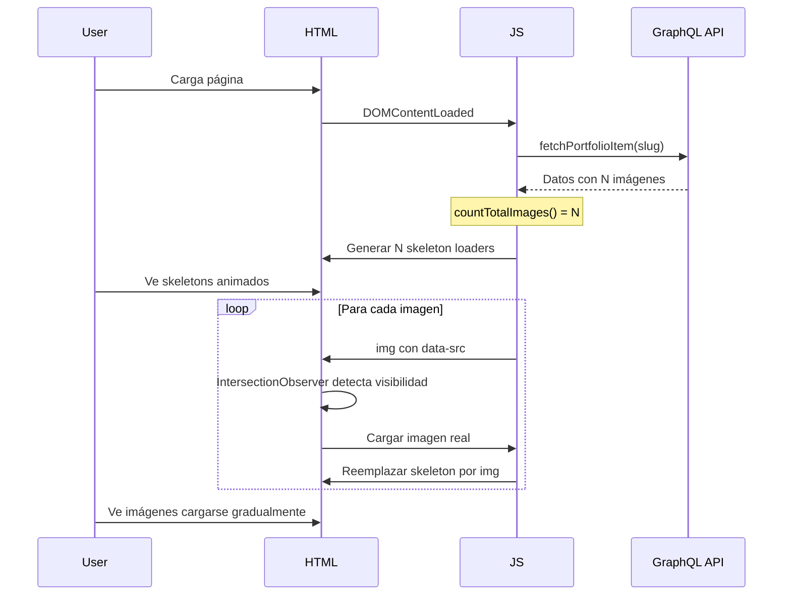

# Plan de Mejora: Carga Progresiva de Imágenes en Portfolio

## Problema Actual

El archivo [`portfolio-item-fetch.js`](shared/components/portfolio/portfolio-item-fetch.js:278) tiene la función [`renderImages()`](shared/components/portfolio/portfolio-item-fetch.js:278) que:

1. **Carga todas las imágenes de golpe** - No hay skeletons dinámicos basados en el número real de imágenes
2. **Skeletons hardcodeados** - En el HTML hay exactamente 4 skeletons de imagen fijos
3. **Sin carga progresiva** - Las imágenes aparecen abruptamente cuando el DOM se actualiza
4. **Layout shift posible** - No se reserva espacio antes de cargar las imágenes

```html
<!-- Skeletons actuales - hardcodeados y fijos -->
<div class="portfolio-images">
  <div class="skeleton skeleton-image"></div>
  <div class="skeleton skeleton-image" style="height: 300px;"></div>
  <div class="skeleton skeleton-image" style="height: 300px;"></div>
  <div class="skeleton skeleton-image" style="height: 350px;"></div>
</div>
```

## Solución Propuesta

### 1. Contar imágenes antes de renderizar

En [`fetchPortfolioItem()`](shared/components/portfolio/portfolio-item-fetch.js:140), calcular el total de imágenes:

```javascript
function countTotalImages(data) {
  const featuredCount = data.featuredImage ? 1 : 0;
  const portfolioCount = data.portfolioImages ? data.portfolioImages.length : 0;
  return featuredCount + portfolioCount;
}
```

### 2. Generar skeletons dinámicos

En [`renderImages()`](shared/components/portfolio/portfolio-item-fetch.js:278), crear skeletons según el número real:

```javascript
function createSkeletonPlaceholders(count) {
  return Array(count)
    .fill(0)
    .map(
      (_, i) => `
        <div class="skeleton skeleton-image skeleton-loading" data-image-index="${i}">
            <div class="skeleton-shimmer"></div>
        </div>
    `,
    )
    .join("");
}
```

### 3. Carga progresiva con IntersectionObserver

```javascript
function setupProgressiveImageLoading() {
  const observer = new IntersectionObserver(
    (entries) => {
      entries.forEach((entry) => {
        if (entry.isIntersecting) {
          const img = entry.target;
          const src = img.dataset.src;

          // Crear nueva imagen y esperar a que cargue
          const newImg = new Image();
          newImg.onload = () => {
            img.replaceWith(newImg);
          };
          newImg.src = src;

          observer.unobserve(img);
        }
      });
    },
    {
      rootMargin: "100px", // Empezar a cargar 100px antes de visible
      threshold: 0.1,
    },
  );

  document
    .querySelectorAll(".portfolio-images img[data-src]")
    .forEach((img) => {
      observer.observe(img);
    });
}
```

### 4. Evitar layout shift con aspect-ratio

En [`portfolio.css`](shared/components/portfolio/portfolio.css:711):

```css
.skeleton-image {
  width: 100%;
  aspect-ratio: 16 / 9; /* O guardar aspect-ratio real de cada imagen */
  min-height: 200px;
  max-height: 500px;
  animation: shimmer 1.2s ease-in-out infinite;
}
```

## Archivos a Modificar

| Archivo                                                                            | Cambio                                                                  |
| ---------------------------------------------------------------------------------- | ----------------------------------------------------------------------- |
| [`portfolio-item-fetch.js`](shared/components/portfolio/portfolio-item-fetch.js)   | Actualizar `renderImages()` para skeletons dinámicos y carga progresiva |
| [`portfolio.css`](shared/components/portfolio/portfolio.css)                       | Añadir estilos para skeleton-loading y aspect-ratio                     |
| [`index.html`](portfolio/fish-grill-restaurant-diseno-de-marca/index.html:311-316) | Simplificar skeletons iniciales                                         |

## Flujo de Carga Mejorado



## Beneficios

1. **Mejor UX** - El usuario sabe cuántas imágenes vendrán
2. **Sin layout shift** - Se reserva espacio antes de cargar
3. **Carga gradual** - Las imágenes aparecen progresivamente
4. **Performance** - Solo carga imágenes cercanas al viewport

## Siguientes Pasos

1. [ ] Aprobar este plan
2. [ ] Implementar cambios en `portfolio-item-fetch.js`
3. [ ] Añadir estilos CSS necesarios
4. [ ] Probar con datos reales
